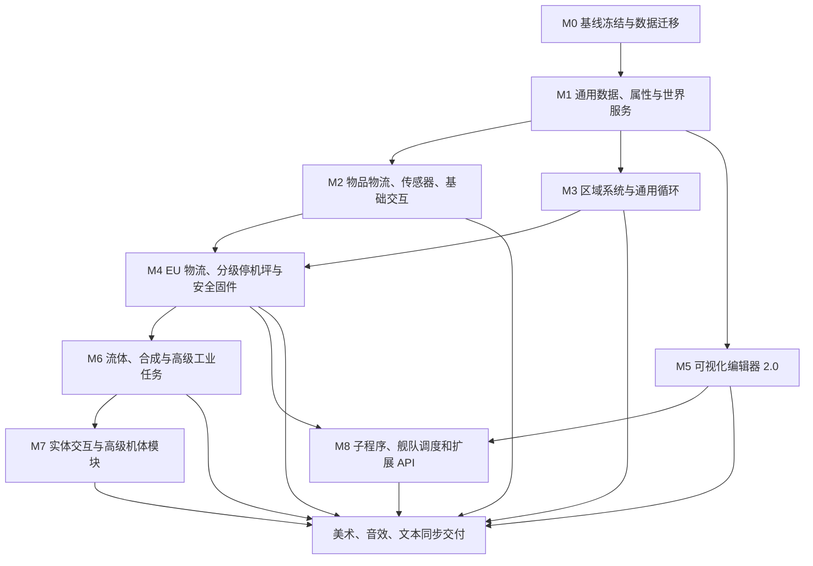

# DrTech EU 可编程无人机完整落地方案

> 当前仅包含未完成内容的执行清单见 [待落地总清单与优先级](drone-pending-work-priority.md)。

> 状态：实施中（M0 已落地）  
> 制定日期：2026-08-12  
> 对照项目：PneumaticCraft Repressurized 本地源码  
> 实施原则：DrTech 原生 EU 重构，不直接照搬压力系统  
> 排除范围：旧 `MetaTileEntityDronePad.java` 不参与设计、迁移或实现

## 1. 项目目标

后续不以“复制 PneumaticCraft 的拼图数量”为目标，而是建设一套 DrTech 原生的 EU 工业无人机系统。保留现有强类型图、结构化流程、服务端编译、断点调试和瞬间破坏；补齐过滤器、传感器、世界交互、区域、EU/流体物流、停机坪网络、舰队调度、完整编辑器和美术表现。

完整目标包括：

- 使用 GregTech EU 的 HV、EV、IV 分级无人机。
- 支持可视化、强类型、可编译、可调试、可迁移的程序图。
- 支持物品、流体、EU、方块和实体相关的工业任务。
- 支持分级停机坪、自动返航、备用停机坪和舰队任务。
- 支持第三方节点扩展和可选电脑模组集成。
- 每项功能同步交付美术、音效、双语文本、测试和示例程序。

### 1.1 核心设计原则

- 全部使用 EU，不保留压力或 RF 语义。
- 挖掘保持瞬间破坏，但仍检查权限、不可破坏方块和 EU。
- 服务端是唯一执行者，客户端只负责编辑、显示和发送受验证的命令。
- 高级动作受机体模块限制。
- 原有程序卡和无人机 NBT 必须可迁移。
- 新节点必须同时交付执行器、编辑器、美术、语言和测试。
- 不依赖低级 Label/Jump，继续使用 Branch、Repeat、While 等结构化流程。

## 2. 当前实现基线

以下内容已经落地，后续不重复开发：

- HV、EV、IV 三档 EU 无人机。
- EU 储能、移动和作业耗电。
- 电池、推进、能效、货舱、无线五类升级。
- 18 格物理货舱，按机体和升级开放。
- 无人机实体、物品化回收、死亡掉落和 NBT 持久化。
- 所有者限制。
- A* 寻路和悬浮移动。
- FakePlayer 瞬间挖掘和放置。
- 物品导入、导出和自动拾取。
- 返回停机坪和停机坪充电。
- 32 个可视化节点。
- 强类型数据端口。
- Branch、Repeat、While、数学、布尔和数字变量。
- 服务端编译和程序格式校验。
- Undo/Redo 和 revision 冲突保护。
- 断点、暂停、继续、单步、执行轨迹和无线调试。
- 基础实体模型、实体贴图、三档物品图、程序卡和五个升级图标。
- 47 项无人机单元测试。

主要基线文件：

- `src/main/java/com/drppp/drtech/common/drone/program/registry/DrTechDroneNodes.java`
- `src/main/java/com/drppp/drtech/common/drone/program/model/DronePortType.java`
- `src/main/java/com/drppp/drtech/common/drone/program/codec/DroneProgramNbtCodec.java`
- `src/main/java/com/drppp/drtech/common/drone/program/runtime/DroneRuntimeEnvironment.java`
- `src/main/java/com/drppp/drtech/common/drone/hardware/DroneHardwareStats.java`
- `src/main/java/com/drppp/drtech/common/drone/machine/MetaTileEntityDroneDock.java`
- `src/main/java/com/drppp/drtech/Client/drone/DroneProgramCanvasWidget.java`
- `art_source/drone/`
- `art_source/drone_hardware/`

## 3. 总体实施依赖



## 4. M0：冻结基线和建立版本迁移体系

这是所有后续功能的前置阶段。

### 4.0 落地状态（2026-08-12）

- [x] 当前基线测试通过。
- [x] 程序 Schema 版本提升到 2，Schema 1 可自动迁移。
- [x] 未知第三方节点保留原 ID，并在画布显示为缺失节点；编译器拒绝执行。
- [x] 无人机物品加入数据版本、稳定 DroneId、Owner UUID 和机体 ID。
- [x] 无人机回收、死亡掉落和重新部署保留稳定身份与所有者。
- [x] FakePlayer 身份改用稳定 DroneId，不再依赖临时实体 UUID。
- [x] 升级存档改为 `ResourceLocation + Level`，并兼容旧 ItemStackHandler 槽位 NBT。
- [x] 程序卡写入统一经过版本化数据入口。
- [x] 迁移回归测试增至 52 项，0 失败。

### 4.1 基线工作

1. 固化当前实现为可回退基线。
2. 执行完整测试和构建。
3. 为无人机物品增加稳定数据字段：

```text
DroneDataVersion
DroneId
OwnerUUID
ChassisId
UpgradeDataVersion
ProgramDataVersion
```

4. 将程序格式从“只接受当前 Schema”改为迁移链：

```text
Schema 1 -> Schema 2 -> 后续版本
```

5. 新增迁移组件：

```text
DroneProgramMigrator
DroneItemDataMigrator
DroneUpgradeDataMigrator
DroneRuntimeStateMigrator
```

6. 未识别的第三方节点不直接毁掉程序，改用“缺失节点占位符”；占位程序禁止运行，但允许进入编辑器修复。
7. 现有 HV/EV/IV metadata 保持 `0/1/2`。
8. 现有停机坪注册 ID 保留，并视为 HV 停机坪。

### 4.2 升级数据重构

当前升级槽数量依赖 `DroneUpgradeType.values().length`。继续向枚举追加模块会形成长期存档风险，因此需要改为稳定格式：

```nbt
Upgrades: [
  {Id:"drtech:battery", Level:1},
  {Id:"drtech:cargo", Level:1}
]
```

旧的按槽位保存格式在加载时自动转换。

### 4.3 验收标准

- 当前 47 项测试全部通过。
- 原有程序卡可正常加载、编辑和写回。
- 已部署无人机重启世界后保持程序、货物、EU、升级、停机坪和运行状态。
- Schema 1 程序可以自动升级。
- 未知节点不会导致服务器崩溃或整张程序丢失。

## 5. M1：通用数据、属性与世界服务层

本阶段不追求大量新节点，重点是防止后续功能重复造轮子。

### 5.0 当前落地状态（2026-08-12）

- [x] 新增 `BLOCK_FILTER` 和 `ACTION_STATUS` 强类型端口。
- [x] 建立客户端无关的节点属性类型、属性定义和统一服务端校验。
- [x] 现有数字、布尔、坐标、区域、循环、变量、半径和运算符配置接入声明式属性。
- [x] 将运行环境拆分为移动、方块、物品、流体、EU、实体、传感器和停机坪服务接口。
- [x] 建立细分动作状态，为失败端口和动作状态数据节点提供稳定语义。
- [x] 建立物品、方块、流体和实体过滤器规格及有界 NBT 编解码。
- [x] 现有物品过滤节点兼容新多规则过滤器，同时继续读取旧 `Item + Meta` 配置。
- [x] 建立物品转移、世界查询、交互和区域遍历请求对象。
- [x] 编程器属性区改为由属性定义驱动的通用数字、布尔、枚举、方向、文本和物品选择控件。
- [x] 过滤器选择器初版支持手持物多规则、黑白名单、metadata 与 NBT 精确捕获；服务端限制 64 条规则、8 层深度、2048 标签和有界字符串/数组。

### 5.1 端口类型

当前已预留：

- `STRING`
- `FLUID_FILTER`
- `ENTITY_FILTER`
- `DIRECTION`
- `DOCK_REFERENCE`
- `PROGRAM_REFERENCE`

需要补充：

- `BLOCK_FILTER`
- 可选的 `ITEM_STACK`
- 可选的 `FLUID_STACK`
- 可选的 `ACTION_STATUS`

### 5.2 统一过滤器

新增：

```text
DroneItemFilterSpec
DroneBlockFilterSpec
DroneFluidFilterSpec
DroneEntityFilterSpec
DroneFilterMode
```

物品过滤器至少支持：

- 单物品和多物品。
- metadata 精确或忽略。
- NBT 精确或忽略。
- Ore Dictionary。
- 模组命名空间。
- 白名单和黑名单。
- 耐久范围。
- 数量范围。

方块过滤器至少支持：

- 方块 ID。
- metadata。
- BlockState 属性。
- 是否有 TileEntity。
- 是否可替换。
- 矿石、木材、作物等 Ore Dictionary 分类。

### 5.3 统一动作请求

新增不可变请求对象：

```text
DroneTransferRequest
DroneWorldQuery
DroneInteractionRequest
DroneAreaTraversalRequest
```

统一包含：

- 坐标或区域。
- 访问方向。
- 最大数量。
- 每批数量。
- 过滤器。
- 最近、顺序或随机搜索。
- 失败策略。
- 是否跳过不可访问目标。

### 5.4 拆分运行环境

将持续膨胀的 `DroneRuntimeEnvironment` 拆分为：

```text
DroneMovementService
DroneBlockActionService
DroneItemService
DroneFluidService
DroneEnergyService
DroneEntityService
DroneSensorService
DroneDockService
```

实体运行环境负责组合这些服务。

### 5.5 标准化动作结果

动作结果扩展为：

```text
SUCCESS
RUNNING
NOT_FOUND
NO_SPACE
NO_RESOURCE
NO_ENERGY
OUT_OF_RANGE
UNLOADED
DENIED
UNREACHABLE
INVALID_TARGET
ERROR
```

动作节点增加可选 `failed` 流程端口；未连接时保持当前进入错误状态的行为。

### 5.6 通用节点属性系统

新增：

```text
DroneNodePropertyDefinition
DroneNodePropertyType
DroneNodePropertyValidator
```

属性类型：

- Integer/Double。
- Boolean。
- Enum。
- String。
- Item Selector。
- Fluid Selector。
- Entity Selector。
- Direction。
- Coordinate Capture。
- Area Editor。
- Program Reference。
- Dock Reference。

后续新增节点只声明属性，不再为每个节点硬编码整个编程器 GUI。

### 5.7 验收标准

- 新旧节点都能由通用属性面板编辑。
- 所有过滤器和请求对象可独立 NBT 序列化。
- 服务端拒绝非法方向、超长字符串、超大过滤列表和恶意 NBT。
- Schema 1 程序仍可运行。

## 6. M2：物品物流、传感器和基础世界交互

这是最优先补齐 PneumaticCraft 实用能力的阶段。

### 6.0 当前落地状态（2026-08-12）

- [x] `Import Items` / `Export Items` 支持明确访问方向、最大搬运量和单批数量，并兼容旧坐标程序。
- [x] 所有动作节点提供可选 `failed` 端口；未连接失败端口时仍进入运行时错误。
- [x] 运行时持久化上次动作状态和错误文本，提供状态值、错误文本与状态比较节点。
- [x] 增加货舱物品数、货舱空槽、货舱占用率和指定方向库存物品数传感器。
- [x] 增加红石强度与方块/天空/最大光照等级传感器。
- [x] 新传感器进入可视化节点库独立页面，带双语名称和传感器分类色。
- [x] 方块过滤器支持准星捕获多规则、metadata、黑白名单、移除末条和清空，并复用有界 NBT 校验。
- [x] 增加方块匹配、坐标可达和停机坪可用性传感器。
- [x] 增加空手方块右键与过滤物品右键动作，支持指定面、潜行、EU 消耗和语义失败端口。
- [x] 增加带上限短路的区域匹配方块计数传感器，区域仍受 4096 方块运行限制。
- [x] 增加范围拾取与过滤丢弃动作；拾取先模拟空间，丢弃物带拾取延迟，避免同 tick 复制或立即吸回。
- [x] 增加成熟小麦类作物、地狱疣和可可豆瞬间收割，破坏继续经过 FakePlayer 权限事件。
- [x] 收割兼容 DrTech CropQT 杂交作物架：通过 FakePlayer 空手右键走原生收获逻辑，保留作物架、作物 ID 与 Growth/Gain/Resistance 属性，并重置生长阶段。
- [x] `Import Items` / `Export Items` 支持坐标或区域二选一，编译器拒绝缺失目标与双目标。
- [x] 区域库存支持最近、遍历顺序和稳定随机搜索，可跳过无物品、无空间或无能力的候选容器。
- [x] Import、Export、拾取和丢弃节点提供 `amount` 数字输出；结果按节点 UUID 持久化，可直接连接变量、数学和比较节点。
- [x] 增加专用无人机红石发射端点（固定 MTE ID 902）：六面真实输出 0–15、NBT 持久化、加载恢复和邻居更新。
- [x] 增加“设置红石输出”动作节点与“输出红石强度”传感节点；动作接近端点后消耗方块交互 EU，支持数字输入覆盖配置值。
- [x] 红石端点已注册合成配方、HV 外壳与 GregTech 发射器面视觉、节点库入口和中英文本。
- [x] 当前无人机回归测试增至 94 项，0 失败。

### 6.1 数据和传感器节点

- 方向。
- 方块过滤器。
- 无人机货舱物品数量。
- 无人机空闲货舱格数。
- 无人机货舱使用百分比。
- 容器内物品数量。
- 区域内匹配方块数量。
- 红石强度。
- 光照等级。
- 方块是否匹配。
- 坐标是否可到达。
- 停机坪是否可用。
- 上一次动作状态。
- 上一次动作错误文本。

### 6.2 升级现有物品物流节点

`Import Items` 和 `Export Items` 增加：

- 坐标或区域输入。
- 明确访问方向。
- 最大搬运数量。
- 每次搬运数量。
- 最近库存搜索。
- 跳过满库存。
- 失败端口。
- 搬运数量输出。

现有只有坐标的程序继续有效。

### 6.3 新增动作节点

- 拾取掉落物。
- 丢弃物品。
- 方块右键。
- 作物收割。
- 输出红石。
- 设置红石强度。
- 等待红石强度。
- 使用物品。
- 使用方块上的物品。

自动拾取改为可配置固件行为：

```text
关闭
拾取任意物品
只拾取过滤器匹配物品
仅程序执行“拾取”时拾取
```

### 6.4 FakePlayer 完善

- 保持服务端 FakePlayer。
- 身份策略支持“无人机专用身份”与“所有者身份”配置。
- 所有破坏、放置、右键和攻击统一触发 Forge 权限事件。
- 记录 DroneId、Owner UUID 和 ProgramId，方便服务器日志追踪。

### 6.5 验收程序

```text
如果输入箱有至少 64 个铁锭
  从 DOWN 面导入 32 个
  飞到输出箱
  从 UP 面导出
否则
  等待红石信号
```

重启、区块卸载、货舱满、箱子消失、领地拒绝时都不能复制或吞物品。

## 7. M3：区域系统 2.0 和通用循环

### 7.0 当前落地状态（2026-08-12）

- [x] 增加 `For Each Coordinate` 通用流节点，按区域蛇形顺序逐坐标输出，可连接挖掘、放置、交互、传感和红石端点等任意坐标动作。
- [x] 遍历索引进入运行时 Memory NBT，区块卸载、实体保存和重新载入后可从当前坐标继续。
- [x] 增加球体/球壳与竖直圆柱/圆柱壳动态区域节点，半径和高度可由数字节点驱动并经过安全钳制。
- [x] 增加两点体素路径区域，可配置 0–3 格球形厚度，过长路径在生成前拒绝。
- [x] 增加区域并集、交集、差集、偏移、包含坐标和坐标数值节点；组合结果保持稳定遍历顺序并继续受 4096 坐标限制。
- [x] 增加由原点和两条边终点定义的任意空间朝向体素平面。
- [x] 路径区域已经支持两点体素路径；新增区域向外扩展、向内收缩，以及蛇形、反向、从上到下、确定性随机四种持久化遍历策略。
- [x] 区域扩展/收缩的尺寸、空区域、越界拒绝与四种遍历排列已纳入回归测试。

### 7.1 区域数据结构

保留现有 `DroneArea` 兼容层，新增：

```text
DroneAreaSelection
AreaShape
AreaTraversalOrder
AreaIteratorState
```

### 7.2 区域形状

- 实心长方体。
- 空心长方体。
- 框架。
- 六面墙。
- 单平面。
- 直线。
- 球体。
- 空心球。
- X/Y/Z 圆柱。
- X/Y/Z 金字塔。
- 网格。
- 随机点。
- 边界厚度。

### 7.3 区域运算节点

- 从两点建立区域。
- 设置区域形状。
- 区域偏移。
- 区域缩放。
- 区域包含坐标。
- 区域并集。
- 区域差集。
- 区域交集。
- 获取区域体积。

### 7.4 通用循环节点

- For Each Coordinate。
- Current Coordinate。
- For Each Item Filter。
- Current Item Filter。
- Break Loop。
- Continue Loop。

循环状态必须写入运行时 NBT，区块卸载后继续原进度。

### 7.5 遍历策略

- X/Y/Z 顺序。
- 当前蛇形遍历。
- 最近点优先。
- 从上到下。
- 从下到上。
- 随机但种子稳定。
- 跳过空气。
- 跳过不匹配方块。

### 7.6 世界可视化工具

增加：

- 无人机坐标标定器。
- 无人机区域投影器。

提供：

- 第一和第二角点捕获。
- 区域线框。
- 形状预览。
- 当前执行坐标高亮。
- 路径预览开关。

### 7.7 初始性能限制

| 机体 | 单任务区域上限 |
|---|---:|
| HV | 4096 坐标 |
| EV | 8192 坐标 |
| IV | 16384 坐标 |

瞬间破坏保持，但每台无人机每 tick 最多执行一个破坏动作，避免一次节点清空上万方块造成卡顿。

## 8. M4：EU 物流、分级停机坪和安全固件

### 8.0 当前落地状态（2026-08-12）

- [x] 原固定 ID 901 停机坪保留为 HV，并新增固定 ID 903/904 的 EV、IV 停机坪；三档使用对应电压外壳、对应单 tick 充电功率和逐级升级配方。
- [x] 停机坪增加稳定 DockId、所有者、名称、启用状态、当前无人机、自动发射、自动回收和待恢复任务状态的 NBT 持久化基础。
- [x] 停机坪扩展为无人机槽与程序卡槽；程序卡会服务端部署到待发射无人机，并保留原程序数据迁移规则。
- [x] 增加发射、召回、自动发射和启用控制；发射时自动绑定停机坪，召回只接受同停机坪且同所有者无人机。
- [x] 增加独立于可视化程序的安全固件状态机：`PROGRAM / RETURNING / CHARGING / RECOVERING / SAFE_IDLE / EMERGENCY_LAND`。
- [x] 默认 20% EU 中断程序返航、90% EU 恢复；当前程序节点、变量和通用循环索引不重置。
- [x] 返航后优先回收为物品并在充满后重新发射；槽位被占用时保持实体停靠充电，所有 EU 转移继续执行模拟后提交与电压等级校验。
- [x] 增加返航黄色闪烁、充电蓝色脉冲、安全待机橙灯和紧急降落红灯状态表现。
- [x] 安全固件状态、阈值和恢复意图进入实体 NBT；缺失停机坪进入安全待机，EU 耗尽进入紧急降落，不无限空跑寻路。
- [x] 增加 `WorldSavedData` 停机坪网络与 `DroneDockRecord`：持久化维度、坐标、DockId、所有者、等级、优先级、心跳、负载、可用 EU 和接收状态，上限 2048 条。
- [x] 停机坪每秒发送服务端心跳；超过 5 秒视为离线、超过一个游戏日清理。存档读取后记录先置为离线，真实机器重新加载并心跳后才可选用。
- [x] 最近停机坪选择严格过滤维度、所有者、电压等级、在线状态、EU、启用和占用状态，并按优先级、距离、DockId 得到稳定结果。
- [x] 主停机坪缺失或无 EU 时，安全固件自动预约同所有者的可用备用停机坪；切换时释放旧预约，不强加载区块。
- [x] 增加“最近停机坪”“绑定停机坪”“解除停机坪”“配置安全固件”可视化节点，并接入编辑器、强类型端口、执行器与双语文本。
- [x] 返航和恢复阈值可由数字输入或属性配置，默认 20%/90%；安全固件数据版本升级到 3，阈值随实体、物品回收和重新发射持久化。
- [x] 增加 GTCE EU 传感节点：读取目标机器 EU、容量和百分比；无有效 EU 能力时返回 -1，不把空容器误报为零电量。
- [x] 增加“导入 EU”“导出 EU”“充电至目标百分比”动作节点，均可使用数字输入或 `MaxEU` 属性控制请求量，并提供本次/累计转移量输出。
- [x] EU 转移通过外部端点适配器执行：检测实际输入/输出面、目标电压和两侧安培包；单 tick 不超过无人机机体一安培包。
- [x] 所有 EU 变动使用外部容器实际返回值结算；目标只接受部分 EU 时剩余 EU 回写无人机，禁止越压和无源复制。
- [ ] 待实现独立 DroneRegistry、跨停机坪舰队视图和停机坪优先级完整 UI；EU 导入/导出节点已经完成。

### 8.1 分级停机坪

将当前固定 HV 停机坪扩展为：

- HV 无人机停机坪。
- EV 无人机停机坪。
- IV 无人机停机坪。

原停机坪 ID 保留为 HV。

每个停机坪增加：

- 稳定 DockId。
- 名称。
- 所有者。
- 优先级。
- 启用或禁用。
- 当前无人机。
- 可用 EU。
- 充电功率。
- 自动发射。
- 自动回收。
- 红石控制。

### 8.2 停机坪网络

使用 WorldSavedData 建立：

```text
DroneDockNetwork
DroneDockRecord
DroneRegistry
```

记录：

- 维度。
- 坐标。
- DockId。
- 所有者。
- 最后心跳时间。
- 是否已加载。
- 当前负载。
- 可用电量。
- 是否可接收无人机。

### 8.3 新增模块

- EU 能源接口模块。
- 高级导航模块。
- 安全固件模块。

### 8.4 EU 节点

- 读取目标机器 EU。
- 读取目标机器容量。
- 读取目标机器 EU 百分比。
- 从机器导入 EU。
- 向机器导出 EU。
- 按指定 EU 数量转移。
- 按目标百分比充电。
- 查找最近可用停机坪。
- 绑定停机坪。
- 解除绑定。
- 选择备用停机坪。

### 8.5 GTCE 安全规则

- 严格尊重电压等级。
- 尊重输入和输出安培。
- 不允许无人机越级强灌电。
- 模拟成功后再实际转移。
- 无人机不能通过重复模拟复制 EU。
- 默认不向外暴露普通电缆连接能力，EU 转移只能通过动作节点或停机坪。

### 8.6 安全固件

每台无人机增加独立于程序的固件配置：

```text
ReturnAtPercent
ResumeAtPercent
MinimumReserveEU
ReturnWhenCargoFull
ReturnWhenDamaged
StuckTimeout
UnloadedTargetPolicy
MissingDockPolicy
```

行为状态：

```text
PROGRAM
RETURNING
CHARGING
RECOVERING
SAFE_IDLE
EMERGENCY_LAND
```

固件优先级高于程序，充满后恢复原节点和循环进度。

### 8.7 验收标准

- 低电量时中断程序、返航、充电并恢复。
- 主停机坪不可用时选择备用停机坪。
- 对低电压机器不会过压。
- EU 总量在所有操作前后守恒。
- 区块卸载不复制 EU，也不丢失任务状态。

## 9. M5：完整可视化编辑器 2.0

本阶段在 M1 完成后可与 M2 至 M4 交错推进。

当前进度（2026-08-13）：节点库已支持按当前语言名称与内部 ID 搜索；画布已支持框选、Shift 多选、批量拖动/删除、子图复制粘贴、横向/纵向对齐、等间距分布、Ctrl 网格吸附、适应选区/全图、确定性流程自动布局、可点击小地图和常用键盘快捷键。子图粘贴会重映射 UUID、保留内部连线并断开外部联系。批量操作通过有 1024 子命令硬上限的服务端原子命令提交，只增加一个 revision、占用一条撤销历史，任一子命令失败时整批回滚。节点别名、断点和程序名均可持久化并撤销。右侧已有可滚轮浏览的诊断页，支持严重性筛选、端口/属性与修复建议提示、点击定位；编译器已支持无出口循环、潜在无限循环和区域超限精确诊断，目标无人机支持模块、机体建议与固定坐标电压预检。节点库现有 107 个节点，包含编辑器专用注释和分组框；端口支持形状辅助识别，连线采用数据层在下、流程层在上的分层绘制，非默认流程出口显示标签，选区外线路自动弱化；节点和画布已提供完整右键上下文菜单；属性页已支持滚轮下拉枚举、六面方向面板、物品注册表/本地化名称搜索、Ore Dictionary 搜索追加、实体注册表/本地化名称搜索和黑白名单编辑、BlockState 捕获与逐属性合法值编辑、区域 X/Z、X/Y 双投影实时预览、停机坪选择器、所有者隔离且锁定 revision 的安全程序引用选择器、注释专用的 1024 字符/32 行受控多行编辑器、单属性恢复默认和修改前后对比，以及玩家/准星/停机坪/无线无人机坐标抓取；当前全套 154 项测试通过。

### 9.1 节点库

- 节点搜索。
- 分类树。
- 收藏节点。
- 最近使用。
- 节点图标。
- 按机体模块显示可用性。
- 缺少模块时显示原因。

### 9.2 画布操作

- [x] 框选和 Shift 多选。
- [x] 批量移动（一次 revision、一次撤销）。
- [x] 复制、粘贴节点或子图，并保留选择范围内连线。
- [x] 批量删除。
- [x] 横向和纵向对齐。
- [x] Shift + 对齐按钮执行横向/纵向等间距分布，首尾节点固定。
- [x] 批量拖动时按 Ctrl 吸附到 16 格网格。
- [x] 自动布局：按流程边从左到右分层，支持选区、全图和闭环组件，一次撤销。
- [x] Fit All 和 Fit Selection 共用动态按钮。
- [x] 小地图：显示节点、选择、运行节点和当前视口，支持点击导航。
- [x] 节点和画布右键上下文菜单：复制/粘贴、删除/断线、布局/对齐、分组/注释和聚焦。
- [x] 键盘快捷键：全选、复制、粘贴、直接复制、撤销、重做、删除、微调、吸附、自动布局和聚焦。

### 9.3 程序可读性

- [x] 编辑器专用注释节点：持久化、复制/撤销兼容、两行画布摘要，不进入运行流程。
- [x] 可调宽高的分组框、标题和六种分组颜色。
- [x] 分组整体移动、复制、删除、折叠和展开；自动布局保持人工分组。
- [x] 非默认流程出口连线标签，低缩放比例自动隐藏。
- 可折叠子图。
- 节点自定义名称。
- [x] 流程线和数据线分层显示，选区外线路自动弱化。
- [x] 端口除颜色外增加形状标识：流程箭头、布尔菱形、数字圆形、坐标准星、区域方框。

### 9.4 属性编辑器

- 数字输入框。
- [x] 可展开、滚轮浏览的下拉枚举。
- [x] 自动与上下南北东西六面方向图形选择。
- [x] 物品注册表与本地化名称搜索，并可直接追加通配 metadata 规则。
- [x] Ore Dictionary 搜索、结果浏览与纯矿辞规则追加。
- [x] 流体注册表与本地化名称搜索。
- [x] 实体过滤值节点、实体注册表与本地化名称搜索、黑白名单编辑。
- [x] 受控长文本/多行编辑器；注释支持 1024 字符、32 行并以一次事务提交。
- [x] 单属性恢复默认、撤销恢复与修改前后差异提示。
- [x] 短文本/数值非法输入的中文即时原因、类型和允许范围提示。
- [x] 坐标抓取：玩家、准星方块、当前停机坪目录项与无线调试无人机位置；区域支持按当前角点写入。
- [x] 紧凑主面板和底部背包锚定，消除放大 GUI 下属性区与背包排序控件的竞争空间。
- NBT 匹配开关。
- 区域形状预览。
- 世界坐标抓取。
- [x] 停机坪选择列表。
- [x] 程序/子程序选择列表与安全、revision 锁定的 `PROGRAM_REFERENCE` 基础；调用栈留在 M8。

### 9.5 编译诊断

- [x] 独立分页诊断列表。
- [x] 错误、警告和信息筛选。
- [x] 点击错误自动定位并居中节点。
- [x] 缺失端口提示和中文修复建议。
- [x] 不可达节点提示和定位。
- [x] 属性错误自动切换并选中对应属性。
- [x] 无出口循环检测。
- [x] 潜在无限循环警告，排除有限重复和区域遍历。
- [x] 区域超限定位与修复提示。
- [x] 诊断记录区域支持鼠标滚轮浏览。
- [x] 目标无人机缺少流体货舱/合成模块提示，并阻止无效写入。
- [x] 固定坐标 EU 目标电压不匹配提示；动态目标保留运行时安全检查。
- [x] 按图规模给出 EV/IV 机体等级建议。
- 电压等级不匹配提示。
- 潜在无限循环警告。

### 9.6 调试增强

- 变量监视列表。
- 数据端口实时值。
- 动作状态和错误码。
- 节点耗时。
- 当前路径。
- 当前区域索引。
- 当前目标。
- 剩余 EU 估算。
- 最近 N 条执行轨迹。
- 条件断点。
- 单步进入和单步跳过子程序。

### 9.7 程序管理

- 程序模板。
- 另存为和重命名。
- 复制程序卡。
- 导入和导出 NBT 文件。
- 示例程序库。
- 最近程序。
- 程序签名和 revision 显示。

### 9.8 验收标准

使用编辑器创建并调试 100 节点程序时：

- 不需要修改 NBT。
- 可以搜索、复制、分组和定位错误。
- Undo/Redo 覆盖批量操作。
- 客户端无法绕过服务端 revision。
- 打开大程序时无明显冻结。

## 10. M6：流体、合成和高级工业任务

### 10.0 落地状态（2026-08-13）

- [x] 追加稳定元数据为 5 的流体货舱模块，不改变旧五种升级模块编号。
- [x] 安装模块后按 HV/EV/IV 启用 16,000/64,000/256,000 mB 内部 FluidTank；有流体时禁止拆除模块。
- [x] 流体随无人机实体存档、物品化回收和再次部署完整保存，物品数据版本提升到 4。
- [x] 完成流体过滤、机载流体量、机载流体百分比、容器流体量、导入、导出、排空、查找流体容器和等待指定流体量 9 个节点。
- [x] 流体传输支持六面方向、最大量、失败端口、累计转移量和 EU 交互消耗，并使用 Forge 流体能力实际返回值结算。
- [x] 无人机控制面板和无线快照可显示流体名称、当前量和容量；完成中英文名称、提示和配方。
- [x] 增加流体容量、物品 NBT 防御性复制、流体查找与等待状态持久化、流体选择器属性边界测试。
- [x] 完成专用流体货舱模块贴图，以及按实际流体颜色显示的传输粒子和限频桶装音效。
- [x] 流体属性支持注册表搜索、本地化名称搜索、候选浏览、点击选择和读取主手流体容器；完成区域内最近已加载流体容器搜索、查找流体容器与等待指定流体量节点。
- [x] 完成第一批机载合成：稳定元数据 6 的合成模块、独立贴图与配方，以及“合成物品”“可否合成”“可合成次数”三个节点；支持 Forge 3×3 有序/无序配方、严格/尽可能多/试算模式和容器余物原子结算。
- [x] 升级栏改为 7 个通用模块槽：模块可放入任意空槽，同类模块禁止重复，电池/扩展货舱/流体货舱的带载拆卸保护保持有效。
- [x] 三个合成节点均支持可选“保留物品 + 保留数量”，连续试算和实际提交不会突破材料保留底线。
- [x] 完成“3×3 配方合成”：九个过滤端口显式对应工作台格位，空端口代表空格，只匹配实际 Forge 有序配方并继续执行原子结算。
- [x] 完成首批通用 GT 机器任务节点：设置机器启用、等待机器空闲、机器运行中、机器已启用、机器进度；通过官方 Workable/Controllable 能力兼容单方块机器和多方块控制器。
- [x] 完成第二批 GT 机器节点：等待并确认完成一次配方、等待输入、输出堵塞、缺电和诊断文本；等待节点持久记录已观察运行与上一进度，不会让原本空闲的机器立即通过。
- [x] 合成、显式网格、机器动作派发、配方完成边沿和输出堵塞分支已纳入回归测试。
- [x] 增加 GT 多方块维修动作、需要维修和故障数量节点；维修使用 `IMaintenance` 的真实故障位与 GT 工具类别，预检工具后逐项结算工具损耗和 EU。
- [x] 维修动作派发、必须备齐工具策略及维护状态组合分支已纳入回归测试；编辑器自动布局测试加入后当前全套 121 项测试通过。

### 10.1 新增硬件

- 流体货舱模块。
- 合成模块。
- 高级物品处理模块。

### 10.2 流体能力

无人机增加内部 FluidTank，但只有安装流体货舱模块时启用。

建议容量：

| 机体 | 基础流体容量 |
|---|---:|
| HV | 16,000 mB |
| EV | 64,000 mB |
| IV | 256,000 mB |

### 10.3 流体节点

- 流体过滤器。
- 无人机流体量。
- 无人机流体百分比。
- 容器流体量。
- 导入流体。
- 导出流体。
- 排空流体。
- 查找流体容器。
- 等待指定流体量。

支持方向、最大量、最近容器和失败端口。

### 10.4 合成节点

- 3×3 配方定义。
- 合成指定次数。
- 尽可能合成。
- 保留指定材料数量。
- 输出数量。
- 模拟检查。
- 配方不存在时走失败端口。

优先使用 Forge/原版配方系统，不硬编码配方。

### 10.5 GT 工业节点

- 读取机器是否工作。
- 读取机器进度。
- 读取机器是否允许工作。
- 切换机器工作状态。
- 检测机器输入或输出是否堵塞。
- 等待机器完成一次配方。
- 使用无人机货舱中的真实 GT 工具维修多方块控制器，并读取维护状态与故障数量。

## 11. M7：实体交互和高级机体模块

### 11.1 新增模块

- 工具臂模块。
- 实体扫描模块。
- 战斗模块。
- 实体收容模块。
- 防水模块。
- 自修复模块。
- 安全访问模块。

### 11.2 实体过滤器

支持：

- 实体注册 ID。
- 生物分类。
- 玩家、动物和怪物。
- 名称。
- UUID。
- 驯服状态。
- 所有者。
- 成年或幼年。
- 血量范围。
- 白名单和黑名单。

### 11.3 实体传感器节点

- 区域实体数量。
- 最近实体。
- 实体坐标。
- 实体血量。
- 是否为主人。
- 是否敌对。
- 无人机受损程度。

### 11.4 实体动作节点

- 实体右键。
- 使用物品右键实体。
- 攻击实体。
- 跟随实体。
- 远离实体。
- 装载实体。
- 释放实体。

攻击和运输必须安装对应模块，并遵守：

- PvP 配置。
- 所有者权限。
- Forge 事件。
- 实体黑名单。
- Boss 禁止运输。
- 玩家默认禁止运输。

### 11.5 辅助动作

- 无人机重命名。
- 待机或关闭旋翼。
- 设置状态灯颜色。
- 编辑告示牌。

传送、自毁和黑客功能作为低优先级可选内容，不进入工业完整版强制范围。

## 12. M8：子程序、舰队调度和扩展 API

### 12.1 子程序

利用已经预留的 `PROGRAM_REFERENCE` 实现：

- 调用子程序。
- 返回。
- 输入参数和输出参数。
- 局部变量和全局变量。
- 最大调用深度 16。
- 递归检测。
- 子程序断点。
- 子程序 revision 锁定。

`External Program` 不扫描任意库存中的未知程序，而是使用安全的程序库和程序引用。

### 12.2 舰队控制器

新增：

```text
DroneFleetController
DroneJob
DroneJobQueue
DroneReservation
DroneEndpoint
```

功能：

- 查看所有已注册无人机。
- 查看位置、电量、货舱、程序和状态。
- 启动、停止和召回。
- 为任务选择最近可用无人机。
- 按机体等级和模块筛选。
- 任务优先级。
- 任务超时。
- 失败重试。
- 目标库存预约。
- 避免两台无人机重复搬运同一批物品。
- 多停机坪负载均衡。

### 12.3 DrTech 原生物流任务

替代 PneumaticCraft 物流框架：

- 物品端点。
- 流体端点。
- EU 端点。
- 请求数量。
- 提供数量。
- 优先级。
- 白名单。
- 最低保留量。
- 最大库存量。

无人机在端点之间执行任务，不复制 PneumaticCraft Logistics Frame。

### 12.4 公共扩展 API

新增 Forge 注册事件：

```text
DroneNodeRegistryEvent
DroneActionRegistryEvent
DroneSensorRegistryEvent
DroneModuleRegistryEvent
```

第三方节点必须提供：

- 稳定 ResourceLocation。
- 端口定义。
- 属性定义。
- 服务端执行器。
- 客户端显示信息。
- 序列化版本。
- 所需模块。
- 权限声明。

### 12.5 OpenComputers 正式兼容

OpenComputers 兼容列入正式开发范围，目标 Minecraft 1.12.2 的 `opencomputers` 模组。实现放入独立
`com.drppp.drtech.compat.opencomputers` 包；只有检测到模组后才注册组件。DrTech 主模块不得在类加载阶段
直接引用 OC 类，未安装 OpenComputers 时必须正常启动、建档和运行无人机。

- [ ] 当前状态：方案已列入 P1 和实际实施顺序，代码与可选 API 依赖尚未落地；进入实现前需要加入匹配当前整合包版本的 OpenComputers API/JAR。

#### 12.5.1 网络组件

计划暴露三个受控组件：

```text
drtech_drone_dock
drtech_drone_programmer
drtech_drone_fleet
```

- `drtech_drone_dock`：控制一座已配对停机坪及其当前无人机。
- `drtech_drone_programmer`：查询程序卡、编译状态和安全程序引用。
- `drtech_drone_fleet`：在舰队控制器落地后查询无人机和提交受预约保护的任务。

组件只能挂载到对应 DrTech 设备，不能把任意无人机实体直接暴露为全局无线组件。

#### 12.5.2 停机坪回调

首批回调：

```text
getDockInfo()
getDroneInfo()
getProgramInfo()
launch()
recall()
start()
pause()
resume()
stop()
setAutoLaunch(enabled)
setDockEnabled(enabled)
```

查询结果使用有界 Lua 表，只返回稳定 DroneId、DockId、机体等级、位置、EU 百分比、货舱占用率、程序名、
运行状态、当前节点和上次错误摘要。不向电脑返回完整物品 NBT、运行时 Memory NBT 或所有者敏感数据。

#### 12.5.3 程序与舰队回调

- 程序器提供 `listPrograms()`、`getProgramInfo(reference)`、`assignProgram(reference)` 和
  `compileProgram(reference)`。
- 电脑只能使用服务端程序库生成的 `PROGRAM_REFERENCE + revision`，禁止上传或拼接任意程序 NBT。
- revision 不匹配、程序编译失败、调用者无权访问或目标卡槽变化时拒绝写入。
- 舰队控制器后续提供 `listDrones()`、`getDrone(id)`、`submitJob(spec)`、`cancelJob(id)` 和
  `listJobs()`；任务仍经过 DrTech 的优先级、预约、超时和所有者校验，电脑不能绕过调度器直接搬运物品。

#### 12.5.4 事件信号

设备向相邻 OC 网络发送限频信号：

```text
drtech_drone_launched
drtech_drone_docked
drtech_drone_state
drtech_drone_error
drtech_drone_low_energy
drtech_drone_job_complete
```

状态变化时发送一次，不允许每 tick 广播。相同错误设置冷却，舰队场景按设备合并信号，防止服务器事件队列被无人机群淹没。

#### 12.5.5 权限与安全边界

- 所有写操作在服务端执行，并校验停机坪/无人机所有者、配对密钥和安全访问配置。
- OC 电脑地址不能自动获得权限；设备首次配对生成可撤销访问令牌，令牌不以明文显示在 Lua 返回值中。
- 配置可分别关闭查询、控制、程序分配和舰队任务；默认禁止跨所有者控制。
- 不允许电脑直接修改 EU、货舱、升级、当前节点、变量或安全固件 NBT。
- 不允许通过回调强加载区块；目标离线时返回稳定错误码。
- 每台设备限制每 tick 回调数、返回表大小和字符串长度；批量查询必须分页。
- 所有控制调用写入服务端审计日志，记录电脑地址、设备、动作和结果，不记录访问令牌。

#### 12.5.6 兼容交付与验收

- 使用 `compileOnly`/可选 API 依赖或隔离桥接层，产物不打包 OpenComputers 本体。
- 增加 OC 存在/不存在两种启动验证，避免 `NoClassDefFoundError`。
- 回调参数错误、权限拒绝、目标卸载、revision 冲突和调用限频均返回明确错误，不导致服务器崩溃。
- 世界重启后设备地址关联、访问配置和未完成舰队任务按各自数据版本恢复。
- 验证 Lua 脚本能够完成“查询停机坪 → 发射 → 监听错误/完成信号 → 召回”，且全过程不能复制 EU、物品或程序。
- 提供中英文 OpenComputers 使用手册和最小 Lua 示例。

ComputerCraft 可在 OpenComputers 桥接稳定后复用同一只读 DTO、权限服务和控制服务实现，不与 OC 代码互相依赖。

## 13. 美术完整落地方案

美术随每阶段交付，不在代码完成后统一补票。

### 13.1 复用现有资源

保留当前：

- HV/EV/IV 无人机物品图。
- 实体贴图。
- 程序卡。
- 五个升级模块。
- 无人机概念图和源图。

当前实体 UV 贴图已从 `64×64` 升级为 `128×128` 像素版；保持原模型的 64 单位 UV 布局，以 2 倍资源分辨率提供更清晰的面板、警示条纹和状态灯细节。原始 `64×64` UV 图保存在 `art_source/drone/textures/programmable_drone_uv_64_v1.png`，游戏资源与 128 像素美术源图分别同步保存。

### 13.2 新模块图标

需要新增：

- 工具臂。
- EU 能源接口。
- 流体货舱。
- 实体扫描。
- 战斗。
- 实体收容。
- 防水。
- 自修复。
- 安全固件。
- 高级导航。
- 合成。
- 舰队通信。

每个图标交付：

- 游戏 PNG。
- 透明源图。
- 有背景展示图。
- 对应 item model。
- 中英文名称和 tooltip。

### 13.3 无人机实体表现

| 状态 | 表现 |
|---|---|
| 空闲 | 蓝青状态灯、低速旋翼 |
| 执行程序 | 绿色状态灯 |
| 移动 | 机体轻微倾斜 |
| 挖掘 | 工具臂伸出、瞬间火花 |
| 放置 | 方块全息预览闪烁 |
| 搬运 | 货舱灯亮 |
| 充电 | 黄色或蓝色 EU 电弧 |
| 低电量返航 | 黄色闪烁 |
| 错误 | 红灯和短促提示音 |
| 断点暂停 | 紫色状态灯 |
| 严重受损 | 烟雾粒子 |

模块通过小型外挂模型或纹理区域可视化，避免所有无人机外观完全一致。

### 13.4 停机坪和机器

- HV/EV/IV 停机坪模型和覆盖层。
- 编程器专用正面覆盖层。
- 舰队控制器模型。
- 停机坪引导灯。
- 充电动画。
- 占用、空闲和禁用状态。
- 无人机起飞和降落标记。

### 13.5 编程器 UI

- 节点底板。
- 不同类别标题条。
- 端口形状。
- 流程线和数据线。
- 错误、警告和断点图标。
- 搜索框。
- 小地图框。
- 分组框。
- 属性控件。
- 调试时间线。
- 每个节点独立图标，或至少每个类别有稳定符号。

端口不能只靠颜色区分：

| 端口 | 视觉符号 |
|---|---|
| FLOW | 箭头 |
| BOOLEAN | 菱形 |
| NUMBER | 圆形 |
| STRING | 文本框形 |
| COORDINATE | 十字准星 |
| AREA | 方框 |
| ITEM | 箱子 |
| FLUID | 水滴 |
| ENTITY | 实体轮廓 |
| EU | 闪电 |

### 13.6 世界反馈

- 区域线框。
- 球体、圆柱和平面预览。
- 当前坐标高亮。
- A* 路径预览。
- 停机坪信标。
- 物流源和目标连线。
- EU 传输粒子。
- 流体传输粒子。
- 红石输出脉冲。

### 13.7 音效

- 旋翼循环声。
- 起飞和降落。
- 停机坪锁定。
- EU 充电。
- 工具臂动作。
- 瞬间破坏冲击声。
- 放置确认。
- 程序开始和结束。
- 错误警报。
- 低电量警报。
- 受损和死亡。

所有声音需要距离衰减和播放频率限制，避免无人机群产生噪声轰炸。

## 14. 配方与平衡

### 14.1 机体定位

| 机体 | 定位 |
|---|---|
| HV | 基础单任务无人机 |
| EV | 中型物流与流体任务 |
| IV | 大区域、复杂程序和舰队任务 |

### 14.2 模块限制

建议保持“同类模块一个槽位”，支持模块等级而不是无限堆叠。

高级功能必须模块化：

- 方块右键和收割：工具臂。
- EU 搬运：能源接口。
- 流体搬运：流体货舱。
- 实体扫描：实体扫描器。
- 攻击：战斗模块。
- 实体运输：收容模块。
- 远程调试：无线模块。
- 自动低电返航：安全固件。

### 14.3 瞬间挖掘平衡

- 每 tick 最多破坏一个方块。
- EU 消耗可根据硬度和机体等级计算。
- 不可破坏方块直接失败。
- 权限拒绝走失败端口。
- 货舱满时根据配置停止、掉落或返航。
- 禁止通过取消事件复制掉落物。

## 15. 性能与安全红线

- 程序节点、连线和配置大小有硬上限。
- 每 tick 程序步骤有预算。
- 每 tick 世界扫描坐标数有预算。
- 区域迭代分 tick 执行。
- 默认不强加载区块。
- 目标区块卸载时暂停或失败。
- 子程序调用深度最大 16。
- 过滤器列表和 NBT 深度受限。
- 所有网络包由服务端验证玩家、距离、所有者和 revision。
- 无人机不能由客户端直接修改 EU、货物或运行节点。
- 物流采用模拟后提交，防止复制。
- 任务预约有超时，防止永久锁定库存。
- 路径失败有冷却，不每 tick 重算完整 A*。
- 大量无人机的传感器扫描要错峰执行。

## 16. 统一节点完成定义

以后每个新节点只有同时满足以下条件才算落地：

1. 在注册表中有稳定 ID。
2. 有完整强类型端口。
3. 有属性定义和默认值。
4. 编译器能校验必需输入。
5. 服务端执行器或值求值器已实现。
6. 运行状态可保存和加载。
7. 有成功、失败和边界测试。
8. 编辑器中可创建、配置、复制和删除。
9. 有中英文名称、tooltip 和端口说明。
10. 有节点图标和类别视觉。
11. 有示例程序。
12. 权限、区块卸载、重启和无能源场景经过验证。

禁止出现“注册了节点但没有属性 UI”“能显示但不能执行”“能执行但不能存档”的半落地状态。

## 17. 优先级收敛

### 17.1 P0：工业可用完整版

- M0 数据迁移。
- M1 通用服务和属性。
- 高级物品过滤器。
- 区域库存搜索、方向和数量。
- 方块、库存、红石和光照传感器。
- 方块右键、收割和红石输出。
- 通用坐标循环。
- 多种区域形状。
- 分级停机坪。
- 低电自动返航。
- EU 导入和导出。
- 编辑器搜索、复制粘贴、分组和错误定位。
- 对应美术、音效、配方和双语文本。

### 17.2 P1：完整工业扩展

- 流体物流。
- 合成。
- GT 机器传感器。
- 子程序。
- 多停机坪。
- 舰队调度。
- DrTech 物流端点。
- OpenComputers 停机坪、程序器和舰队控制兼容。

### 17.3 P2：高级或可选玩法

- 实体运输。
- 战斗。
- ComputerCraft（复用 OpenComputers 兼容层的公共服务）。
- 传送。
- 自毁。
- 黑客玩法。

## 18. 实际实施顺序

后续开发严格按以下顺序推进：

1. 冻结当前基线并验证 47 项测试。
2. 增加 Program、Drone、Upgrade 数据版本和迁移器。
3. 把升级槽保存改为稳定 ResourceLocation。
4. 建立通用节点属性描述器。
5. 建立高级物品过滤器。
6. 建立方向、数量和区域化搬运请求。
7. 升级 Import/Export 节点。
8. 增加库存、方块、红石和光照传感器。
9. 增加右键、收割和红石输出。
10. 进入区域 2.0、For Each 和 EU/停机坪阶段。
11. 完成流体、合成和 GT 机器任务。
12. 完成实体交互、子程序、舰队和扩展 API。
13. 完成 OpenComputers 停机坪/程序器/舰队桥接、安全审计、信号和 Lua 示例。
14. 完成全量美术、音效、示例程序、文档和发布验收。

第一批实施完成后应得到一个完整可验收成果：现有程序不损坏、编辑器更容易扩展、物品物流达到 PneumaticCraft 的实用粒度，并为后续流体、EU、实体和舰队系统建立统一基础。
